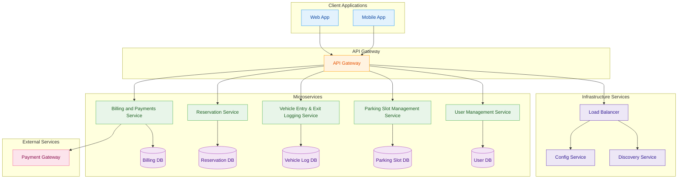

# Vehicle Parking Management System (VPMS)

## Table of Contents

- [Overview](#overview)
- [Features](#features)
- [Technologies Used](#technologies-used)
- [Architecture Diagram](#architecture-diagram)
- [Module Overview](#module-overview)
  - [Parking Spot Service](#parking-spot-service)
  - [Reservation Service](#reservation-service)
  - [User Service](#user-service)
  - [Notification Service](#notification-service)
- [API Gateway](#api-gateway)
- [Discovery Server (Eureka)](#discovery-server-eureka)
- [Setup Instructions](#setup-instructions)
- [Testing](#testing)
- [Advanced Features](#advanced-features)
- [Deployment](#deployment)
- [Contributing](#contributing)
- [License](#license)

---

## Overview

The **Vehicle Parking Management System (VPMS)** is a backend system built using a microservices architecture. It manages parking spot allocation, user registrations, reservations, and real-time notifications. The system exposes RESTful APIs and supports relational databases like **MySQL**, **PostgreSQL**, and **H2** (for development).

---

## Features

- **Parking Spot Management:** Real-time tracking and status updates.
- **Reservation Management:** Bookings, modifications, and cancellations.
- **User Management:** Secure registration, authentication, and role-based access.
- **Notifications:** System updates and reservation alerts via email/SMS.

---

## Technologies Used

| Layer        | Technology               |
|--------------|---------------------------|
| Backend      | Spring Boot (Java)        |
| ORM          | Hibernate / JPA           |
| Databases    | MySQL, PostgreSQL, H2     |
| Security     | Spring Security + JWT     |
| Documentation| Swagger / OpenAPI         |
| Logging      | SLF4J + Logback           |
| Testing      | JUnit + Mockito           |

---

## Architecture Diagram

