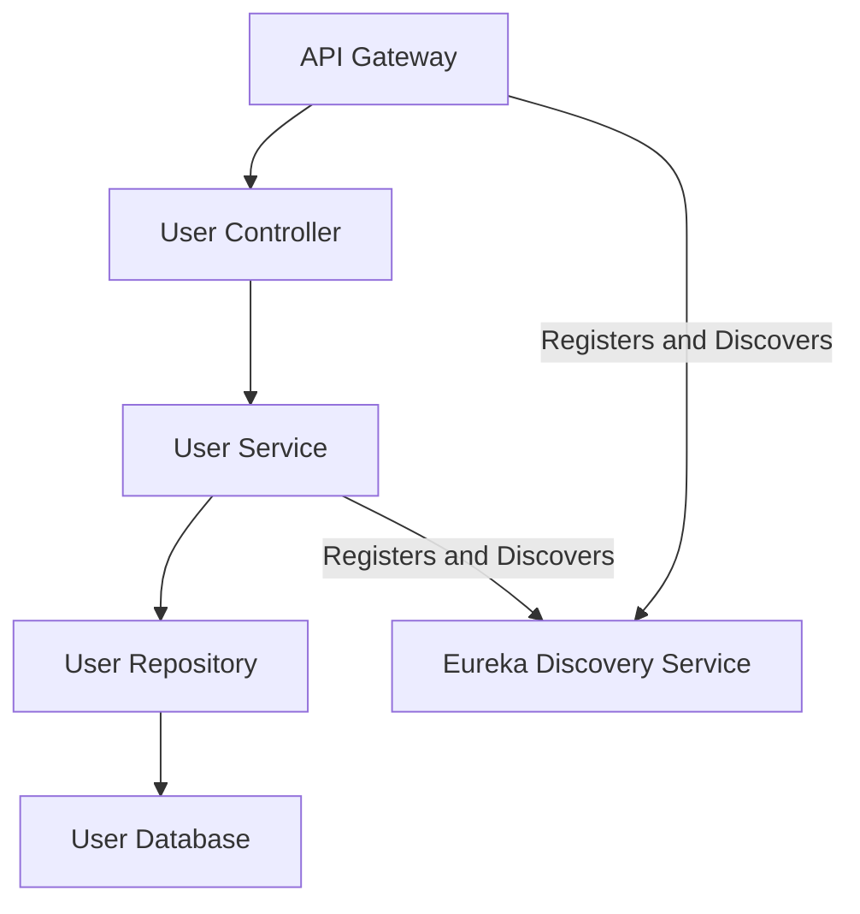

# User-Service Module Low-Level Documentation

This document provides a low-level overview of the `User-Service` module, a microservice within the Parking Management System (PMS) responsible for managing user-related operations.

---

## 1. Project Overview

The `User-Service` module is a core component of the Parking Management System (PMS), dedicated to managing user-specific functionalities. It handles operations such as user creation, retrieval, and role management, interacting with a database to persist and retrieve user information.

### Features

* **Create new users**
    * Allows users to register by providing essential details such as name, email, phone number, and password.
    * Validates user input to ensure data integrity and prevent duplicate entries.
    * Hashes passwords securely using algorithms before storing them in the database.

* **Retrieve user details by ID**
    * Enables fetching specific user information using their unique ID.
    * Ensures efficient querying of the database for quick responses.
    * Returns detailed user information, including name, email, phone number, and role.

* **Retrieve all users**
    * Provides functionality to fetch all registered users in the system.
    * Supports pagination and filtering to handle large datasets efficiently.
    * Returns a list of users with their basic details.

* **Role management for users**
    * Assigns roles (e.g., Admin, User) to users during registration or via admin actions.
    * Restricts access to certain endpoints based on user roles.
    * Allows administrators to update or modify user roles as needed.

* **User profile management**
    * Allows users to view their profile information, including name, email, phone number, and role.
    * Provides functionality for users to update their profile details, such as changing their name or phone number.
    * Enters that only authorized users can modify their own profiles.

---

## 2. Architecture

### 2.1 High-Level Architecture

The `User-Service` module is built using the **Spring Boot** framework and adheres to a **layered architecture**. It communicates with other services via **REST APIs** and utilizes **H2** as its database for local development purposes.

### 2.2 Layered Architecture


### 2.3 Technologies Used

* **Framework:** Spring Boot
* **Database:** H2 (local development)
* **Language:** Java
* **Build Tool:** Maven

---

## 3. Database Design

### 3.1 Database Tables

The `User-Service` module utilizes the following table:

#### User Table

| Column Name | Data Type | Description |
| :---------- | :-------- | :----------------------------- |
| `id` | `Long` | Primary key (auto-generated) |
| `name` | `String` | Name of the user |
| `email` | `String` | Email address of the user |
| `phone` | `String` | Phone number of the user |
| `role` | `String` | Role of the user (e.g., Admin) |

---

## 4. API Endpoints

### 4.1 User Management

* **POST `/api/users/create`**: Create a new user
* **GET `/api/users/{id}`**: Retrieve user details by ID
* **GET `/api/users`**: Retrieve all users

### 4.2 Swagger Documentation

Detailed API documentation can be found via Swagger UI, typically available at `/swagger-ui.html` when the service is running.

---

## 5. Error Handling

The module leverages Spring Boot's exception handling mechanisms to return appropriate HTTP status codes for errors, ensuring clear communication of issues to client applications.

### Common Error Codes

| Error Code | Description |
| :--------- | :-------------------- |
| `400` | Bad Request |
| `404` | Resource Not Found |
| `500` | Internal Server Error |

---

## 6. Dependencies

### Key Dependencies

* **Spring Boot Starter Web**: For building REST APIs
* **Spring Boot Starter Data JPA**: For database interactions
* **H2 Database**: In-memory database for local development
* **Lombok**: For reducing boilerplate code
* **JUnit & Mockito**: For unit testing

---

## 7. Deployment

The `User-Service` module is configured to run on **port `8010`**. It uses **Maven** for building and packaging the application. Database configurations are defined within the `application.properties` file.

### Key Configuration

```properties
spring.application.name=user-service
server.port=8010
spring.datasource.url=jdbc:h2:file:./data/userDB;DB_CLOSE_DELAY=-1;DB_CLOSE_ON_EXIT=FALSE
spring.datasource.driver-class-name=org.h2.Driver
spring.datasource.username=sa
spring.datasource.password=
spring.jpa.hibernate.ddl-auto=update
